| Algorithmes d&#39;apprentissage par renforcement |

# Travail de session
27 novembre - Automne 2020 
Jean-Sébastien Parent

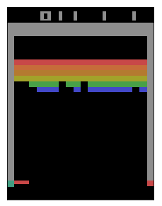

# Mise en contexte

Dans le cadre du cours, nous devons explorer un cas concret d&#39;application d&#39;un système d&#39;apprentissage par renforcement. J&#39;ai choisi d&#39;utiliser le jeu « breakout », un classique d&#39;Atari, pour relever le défi et essayer de rendre autonome un modèle afin de maximiser le score obtenu dans une partie; j&#39;avoue avoir fait ce choix car j&#39;ai toujours aimé le principe du jeu, simple en apparence, mais qui demande quelques stratégies et ne pardonne pas le manque de réflexes.

Heureusement, pour nous aider à mettre en place un environnement, la librairie OpenAI Gym permet de facilement mettre en place des environnements pré faits qui permettent d&#39;interagir avec le jeu et de simuler différentes actions.

De manière simplifiée, on peut voir ces environnements comme des boîtes noires où chaque instant un agent (notre modèle) peut intervenir afin de poser une action, recevoir un signal de récompense et de fin de jeu ainsi que l&#39;état du jeu.

- État initial
- Action posée par l&#39;Agent
- Récompense + nouvel état
- Action posée par l&#39;Agent
- Récompense + nouvel état
- etc.

Les différents environnements d&#39;Atari offert par la librairie OpenAI Gym viennent parfois en versions distinctes; par exemple, dans le cas de « Breakout », il existe la version RAM et la version Écran :

- La version RAM représente l&#39;état à tout instant du jeu sous forme de 128 bytes (valeurs de 0 à 255) représentant toutes les informations du jeu à cet instant.
- La version Écran représente les pixels de l&#39;écran sous forme de matrice de pixels (largeur, hauteur) et où chaque pixel peut avoir jusqu&#39;à 128 couleurs.

Dans mon cas, j&#39;ai choisi d&#39;utiliser la version RAM pour isoler le processus de traitement d&#39;images de l&#39;apprentissage par renforcement en lui-même, on se concentre donc sur la mémoire brute directement dans ce cas.

Le concept du jeu est fort simple; des rangées de brique en haut de l&#39;écran doivent être détruites en utilisant une balle libre et une palette que le joueur contrôle.

- Lorsque la balle touche la palette, un mur ou une brique, elle rebondit dans la direction opposée (X et Y)
- Si la balle tombe dans l&#39;espace sous la palette, le joueur perd une vie
- La partie compte 5 vies au total et le score est cumulatif sur ces 5 vies

Un écran de jeu Breakout ressemble à ceci :

Il est possible, pour l&#39;agent, de faire quatre (4) actions distinctes sur cette version du jeu (Breakout-ram-v0) :

- NOOP (aucune action)
- FIRE (lancement de la balle)
- LEFT (déplacement à gauche)
- RIGHT (déplacement à droite)

L&#39;environnement, suite à une action, retourne une récompense si une brique a été détruite (1) ou rien (0) dans les autres cas.

- Si le joueur n&#39;a plus de vie, il renvoie un signal de fin de partie également (done)

# Processus de décision de Markov

Un processus de décision markovien (PDM) est un environnement dans lequel tous les états sont dits « markoviens » et sur lequel des décisions prises auront une récompense à chaque action posée. Que veut-on dire par états « markoviens » ?

- On parle également dans ce cas d&#39;états qui vont respecter la _propriété de Markov_
- Cela veut dire que l&#39;état actuel est indépendant des actions et des états passés
  - Avec l&#39;état actuel, le fait de connaître le passé n&#39;apporterait pas d&#39;informations supplémentaires pour prédire le futur

Cela permet de faire de l&#39;apprentissage supervisé car on se trouve dans une situation où l&#39;on dispose de :

- Un ensemble fini d&#39;états (Chaque valeur des 128 bytes)
- Un ensemble fini d&#39;actions (Les 4 actions possibles : NOOP, FIRE, LEFT, RIGHT)
- Une matrice de probabilité de transition d&#39;état (inconnue au départ, mais le modèle va tenter de le construire)
- Une fonction de récompense (qui sera construite et mise en place par le modèle au fur et à mesure de la découverte des différents états)
- Facteur de dévaluation que l&#39;on pourra utiliser pour entrainer le modèle

Voici le processus de décision de markov préliminaire qui serait applicable au jeu « Breakout » :

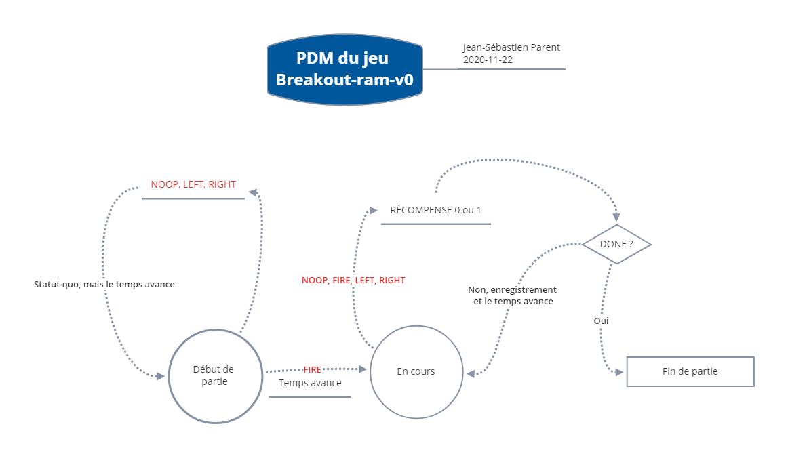

# Une première approche : l&#39;algorithme DQN

Pour débuter le travail de recherche et l&#39;entrainement d&#39;un modèle, j&#39;ai d&#39;abord choisi d&#39;explorer le modèle « Deep Q Network ». On parle ici d&#39;apprentissage par renforcement combiné à l&#39;apprentissage profond. Le concept est ingénieux et s&#39;appuie sur la notion de mémoire de « replay » qui permet à l&#39;algorithme d&#39;échantillonner les séquences présentes dans cette mémoire et de calculer les cibles recherchées à chaque action afin d&#39;optimiser l&#39;erreur moyenne carrée (MSE).

Concrètement, à chaque temps « t », le modèle :

- Choisira l&#39;action at à poser en utilisant une politique epsilon-gloutonne, visant à balancer l&#39;apprentissage et l&#39;exploration
- Enregistrera la transition (st, at, rt+1, st+1) dans sa mémoire de replay
- Prendre un échantillon de transitions (s, a, r, s&#39;) à partir de la mémoire de replay
- Optimiser le MSE entre le réseau cible et le réseau de prédiction, après avoir calculé les cibles

Pour ce faire, j&#39;ai utilisé un epsilon sur le concept de _decay_, tel que vu en cours :

- On commence avec un epsilon à 1
  - Concrètement, on explore!
- Et à chaque fois que l&#39;on franchit un nombre n d&#39;actions, on diminue progressivement et relativement epsilon (à hauteur de 97.5% de sa valeur dans mon cas)
  - On limite le minimum à une valeur donnée, 1% dans mon cas, afin de garder une part d&#39;exploration de moins en moins grande, mais quand même présente

Cela veut dire qu&#39;à chaque action, le modèle va soit :

- Explorer
  - C&#39;est-à-dire prendre une action au hasard parmi les 4 disponibles (NOOP, FIRE, LEFT, RIGHT)
- Demander au modèle profond de prédire la meilleure action, basé sur les apprentissages précédents

Une fois l&#39;action choisie par le modèle, l&#39;environnement retourne 3 informations importantes :

- Le nouvel état
- Une récompense (0 ou 1)
- Un indicateur de fin de partie (done)

On prend alors ces informations et on les donne au modèle pour qu&#39;il apprenne à chaque fois en lui disant, si je vulgarise :

- Voici l&#39;état où j&#39;étais et l&#39;action que j&#39;ai posée
- Voici l&#39;état dans lequel je me trouve maintenant et la récompense obtenue
- Et au fait, le jeu m&#39;a dit que la partie était terminée ou non

Le concept de DQN utilise également 2 réseaux de neurones distincts afin de construire les résultats obtenus :

- Le modèle lui-même et le modèle cible
- À chaque apprentissage, le modèle est actualisé en fonction de l&#39;échantillonnage sur la mémoire de replay et les prédictions du modèle cible
- Le modèle cible est ensuite actualisé en fonction du modèle suivant un facteur _tau_ pour relativiser les poids

## C&#39;est bien beau tout ça, mais concrètement, comment s&#39;est passé le tout me demanderez-vous?

Disons qu&#39;au départ, j&#39;avais vraiment l&#39;impression d&#39;avoir les yeux bandés et de tenter de frapper une cible.

Au début de tout, j&#39;ai parfois constaté que l&#39;algorithme était vraiment très long à entrainer et que rien ou à peu près ne se passait. En examinant les séquences de jeu, je me suis rendu compte qu&#39;il arrivait, sur certaines séquences, que le commande « FIRE » ne soit pas envoyée avant un très long moment, ce qui pouvait fausser toute la séquence prédictive, car le jeu roulait longtemps et la barre se déplaçait de gauche à droite, mais la balle n&#39;était jamais lancée! C&#39;était facile à identifier après coup, car on voyait la longueur des épisodes plafonner au maximum de 2500 instants et faire des scores de 0.

J&#39;ai fait différents essais avec un réseau de neurones de 2X150 couches. L&#39;algorithme apprend un peu, mais c&#39;est surtout aléatoire :

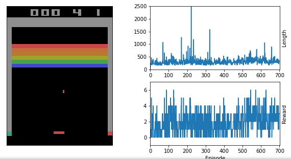

J&#39;ai fait de nombreux essais (très longs à rouler d&#39;ailleurs) et j&#39;obtenais toujours plus ou moins des résultats semblable (un score autour de 6 points dans le meilleur des cas).

J&#39;ai alors commencé à regarder ce qui pouvait se passer et pourquoi l&#39;apprentissage était complexe pour l&#39;agent. Un des points qui me semble difficile pour un agent comme celui-ci, est que la perte de vie ne retourne pas de récompense négative. L&#39;agent ne sait donc pas que perdre une vie est « grave » et ne sait qu&#39;en bout de piste qu&#39;il a épuisé ses vies.

J&#39;ai donc regardé comment je pourrais détecter si une vie avait été perdue; j&#39;ai fait cela en comparant les bytes de la RAM entre chaque état et en validant le nombre de vies restantes affichées à l&#39;écran vs l&#39;état de la mémoire :

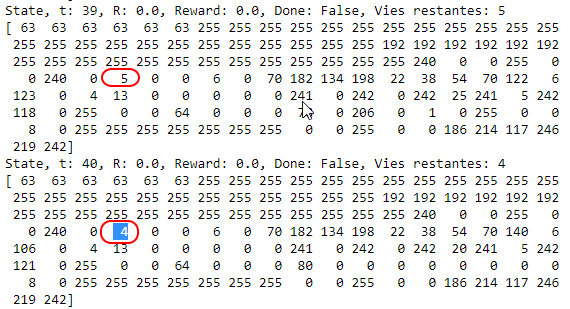

J&#39;ai donc identifié le _byte_ qui m&#39;intéressait et lorsque l&#39;état suivant avait une valeur inférieure pour ce byte à l&#39;état actuel, je pouvais assurément détecter une perte de vie. J&#39;ai donc introduit un concept de récompense négative à -100. (Suite à une discussion avec Mikael à ce propos, il m&#39;a fait remarquer que ce n&#39;était pas une bonne idée, car on se trouvait à tricher l&#39;environnement et ne plus respecter le concept d&#39;apprentissage par renforcement dans un tel cas; je comprends tout à fait, mais je vais quand même exposer ce que cela m&#39;a permis d&#39;atteindre comme score).

J&#39;ai aussi voulu mettre un concept de pénalité sur le temps qui s&#39;échappe, pour tester, à raison de -0.01; j&#39;ai cependant laisser tomber ce concept suite à la discussion avec Mikael, bien que j&#39;ai gardé le code pour le faire (je passe désormais 0 aux 2 valeurs par défaut).

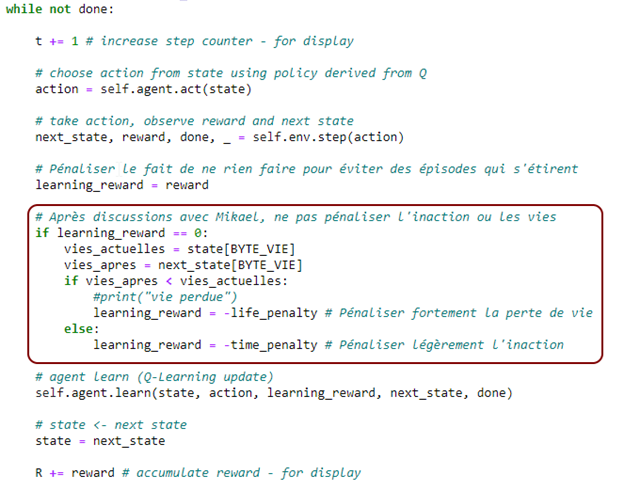

Avec cette stratégie en place, j&#39;ai obtenu des résultats avec un score de 15 points :

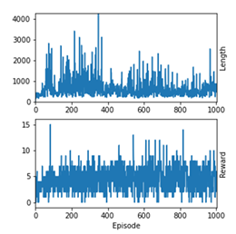

J&#39;ai ensuite voulu pousser plus loin en « simulant » que les états de vies demeuraient stables, de mêmes que le score, car dans les faits, ces 2 valeurs ne devraient pas avoir d&#39;incidence sur l&#39;action à poser. En effet, qu&#39;il reste 2 ou 5 vies, la décision de bouger à droite ou à gauche ne devrait pas être différente. Même chose pour le score. J&#39;ai plus tard abandonné ce concept également, pour ne pas altérer l&#39;environnement et l&#39;agent.

À cet effet, j&#39;ai également essayé de limiter à une vie les épisodes, de façon à obtenir le meilleur score à une vie (ultimement, on veut maximiser le score à chaque vie et non sur la partie, car ce faisant on va maximiser le score de la partie, du moins c&#39;était mon hypothèse). J&#39;ai obtenu de bons résultats, à savoir jusqu&#39;à 9 points par vie (donc théoriquement un genre de 45 points si j&#39;extrapole et je suis optimiste sur les 5 vies).

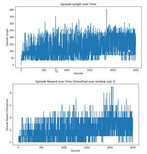

J&#39;ai par la suite tenté d&#39;ajuster les couches de neurones en mettant 2X128, toujours à une seule vie. Dans ce cas, on voit que ça a été vraiment long avant que le modèle ne découvre que l&#39;action FIRE initiait le jeu, car le score demeure sensiblement le même :

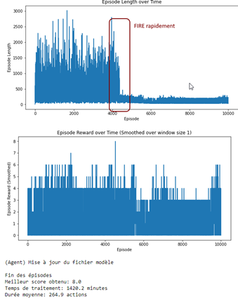

### Retour au modèle sans pénalité de vie

Je suis revenu à un modèle où je n&#39;altérais pas les récompenses ni les états. J&#39;ai décidé d&#39;essayer avec 4 couches de 128 neurones.

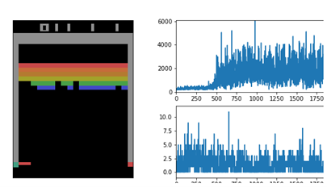

On voit qu&#39;à un certain moment autour du 500e épisodes, le modèle a pris plus de temps avant de lancer la balle, mais n&#39;a pas amélioré son score pour autant. J&#39;ai obtenu 11 comme maximum dans ce cas. Un peu décourageant quand on pense que les meilleurs algorithmes peuvent aller jusqu&#39;à 430 environ.

J&#39;ai donc décidé de regarder du côté du modèle _Actor-Critic_, par curiosité.

# Prise 2 : Modèle _Actor-Critic_

Un peu déconfit de mes résultats obtenus, je me suis penché sur le concept d&#39;_Actor-Critic_ tel que vu dans le cours. Une des raisons est le temps de traitement qui est beaucoup (_vraiment_ beaucoup) plus rapide. On parle de 4-6 heures pour 1000 épisodes en DQN vs une heure environ en AC.

Concrètement, ce type de modèle s&#39;appuie sur 2 composants :

- L&#39;acteur, qui représente la politique responsable du choix des actions
- Le critique, qui représente l&#39;évaluation de la qualité des actions choisies par l&#39;acteur
  - C&#39;est le critique qui y propose des améliorations

Ce modèle apprend à la fois la politique et la fonction de valeur au cours de ses expériences. On parle d&#39;avantage lorsque le modèle fait la différence entre la fonction d&#39;action et celle de valeur, car cela représente la récompense de plus qu&#39;on obtiendrait sur une action donnée versus si on s&#39;en tenait à la politique.

### Premier essai avec 2 couches de 32 neurones, _alpha = 0.001, beta = 0.005_

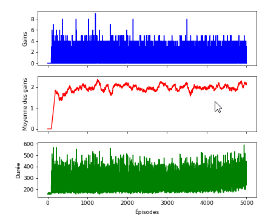

- Meilleur score obtenu: 9.0
- Durée moyenne: 289.4 actions
- Score moyen: 1.92 points

J&#39;ai diminué _gamma_ à 0.95 et ensuite à 0.8 au lieu de 0.99, par curiosité, mais j&#39;ai obtenu des résultats très similaires.

### Changement des valeurs alpha et beta (learning rate) à 0.005 et 0.001

Je voulais voir l&#39;incidence du changement de _learning rate_ sur l&#39;acteur (alpha) et le critique (beta), voici les résultats obtenus (pas très différents) :

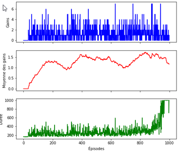

- Meilleur score obtenu: 7.0
- Durée moyenne: 302.3 actions
- Score moyen: 1.27 points

# Conclusion et résultats

J&#39;avoue être resté sur ma faim face aux différents résultats obtenus, j&#39;aurais aimé pouvoir tirer des conclusions claires et avoir une réponse simple et claire sur la finalité. Malheureusement, le meilleur score obtenu dans tous mes essais est de 15 points, ce qui est très peu.

Cela dit, je suis bien heureux d&#39;avoir pu expérimenter et tester différents algorithmes; l&#39;univers de l&#39;apprentissage par renforcement est vaste et je vais certainement le revisiter au cours des prochains mois. J&#39;aime beaucoup l&#39;aspect ludique mis de l&#39;avant par des librairies comme OpenAI Gym, cela rend l&#39;apprentissage plus intéressant et on peut presque dire que c&#39;est hypnotisant en mode interactif de voir l&#39;agent tenter de résoudre et de jouer correctement.

J&#39;ai beaucoup aimé l&#39;expérience, mais je vais devoir m&#39;y remettre à tête reposée pour explorer vraiment chaque différent algorithme. Mention honorable d&#39;ailleurs à l&#39;algorithme SARSA pour trouver les chemins dans les premiers exercices, j&#39;ai vraiment adoré le concept et l&#39;application de celui-ci, bien que je n&#39;en ai pas fait usage dans ce travail, les possibilités d&#39;états me semblant beaucoup trop grands pour être envisageable (256^128).

Mention spéciale à tous ceux qui ont trouvé leur compte dans les formules mathématiques avancées, j&#39;avais hâte de voir le code pour mieux comprendre tout cela. 😊

# Références

- [https://gym.openai.com/envs/Breakout-ram-v0/](https://gym.openai.com/envs/Breakout-ram-v0/)
- [https://deepsense.ai/playing-atari-on-ram-with-deep-q-learning/](https://deepsense.ai/playing-atari-on-ram-with-deep-q-learning/)
- [http://cs229.stanford.edu/proj2016/report/BonillaZengZheng- AsynchronousDeepQLearningforBreakout-Report.pdf](http://cs229.stanford.edu/proj2016/report/BonillaZengZheng-%20AsynchronousDeepQLearningforBreakout-Report.pdf)
- [https://towardsdatascience.com/tutorial-double-deep-q-learning-with-dueling-network-architectures-4c1b3fb7f756](https://towardsdatascience.com/tutorial-double-deep-q-learning-with-dueling-network-architectures-4c1b3fb7f756)
- [https://keras.io/examples/rl/deep\_q\_network\_breakout/](https://keras.io/examples/rl/deep_q_network_breakout/)
- [https://becominghuman.ai/lets-build-an-atari-ai-part-1-dqn-df57e8ff3b26](https://becominghuman.ai/lets-build-an-atari-ai-part-1-dqn-df57e8ff3b26)
- [https://becominghuman.ai/beat-atari-with-deep-reinforcement-learning-part-2-dqn-improvements-d3563f665a2c](https://becominghuman.ai/beat-atari-with-deep-reinforcement-learning-part-2-dqn-improvements-d3563f665a2c)